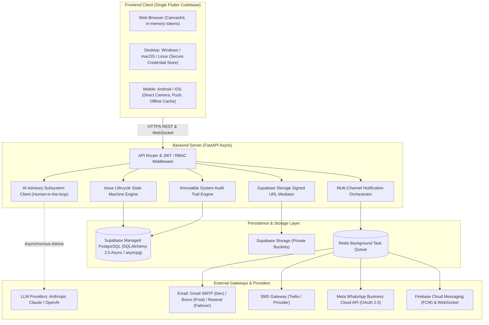
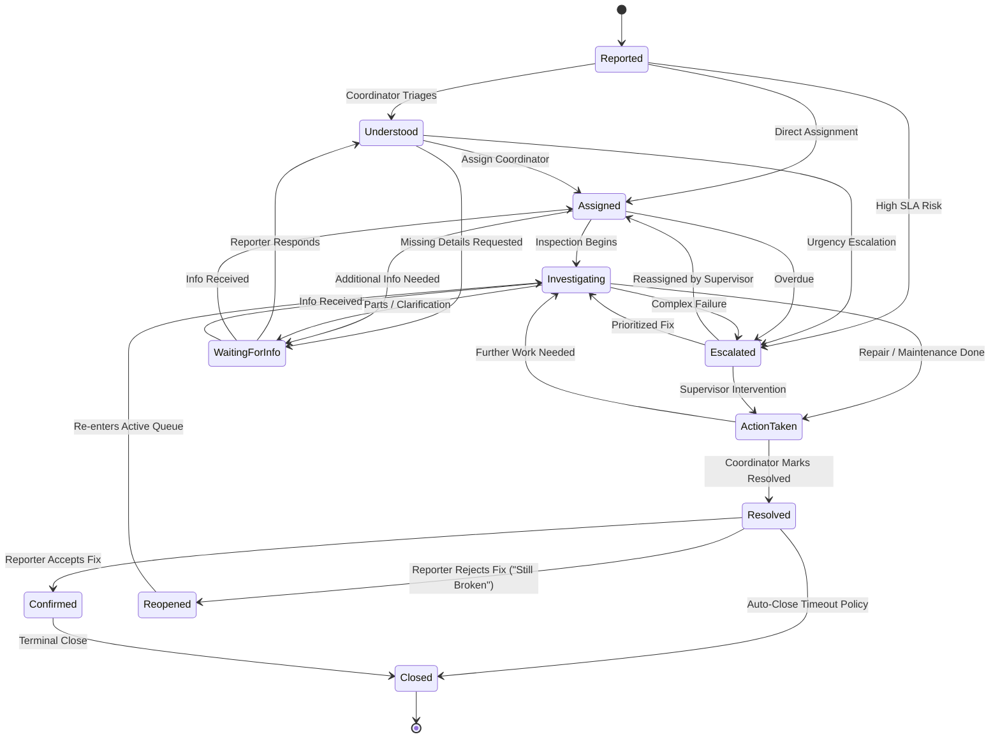

# Campus Care — Technical Architecture & Repository Memory

**Project**: Campus Care (AI-Powered Facilities & Academic Issue Tracker)  
**Repository**: [`samruddhi-1324/Campus-Management-System`](https://github.com/samruddhi-1324/Campus-Management-System)  
**Specification Version**: PRD & SRS v3.0  
**Current Milestone**: Phase 1 (MVP — Facilities Issue Tracker) Core Engine & Client Implemented · Automated Tests Passing (11/11)  
**Last Updated**: 2026-09-17  

---

## 🏛️ System Architecture & Data Flow



---

## 🗄️ Deep Database & Data Model Specification

### 1. Persistence Architecture
- **Engine**: Supabase Managed PostgreSQL using `postgresql+asyncpg://` over pooled connections (`pool_size=10`, `max_overflow=5`, `pool_timeout=30s`).
- **ORM**: SQLAlchemy 2.0 async with `DeclarativeBase` and `TimestampMixin` (`created_at`, `updated_at` with timezone).
- **Migrations**: Alembic with automated schema-drift detection and single-head enforcement in CI/CD.

### 2. Entity-Relationship Matrix (24 Relational Tables)

| Domain | Table Name | Key Attributes | Relationships & Constraints |
|---|---|---|---|
| **Tenancy** | `institutions` | `id`, `name`, `slug`, `domain`, `settings`, `is_active` | Unique `slug` & `domain`. Multi-tenant scoping for Phase 3. |
| **Master Data** | `departments` | `id`, `name`, `code`, `is_active` | Unique `name` & `code`. |
| | `buildings` | `id`, `name`, `code`, `is_active` | Unique `name` & `code`. Parent to `rooms`. |
| | `rooms` | `id`, `building_id`, `room_number`, `floor`, `room_type` | Unique `(building_id, room_number)`. Foreign key to `buildings(id) ON DELETE CASCADE`. |
| | `categories` | `id`, `name`, `slug`, `description`, `default_sla_hours` | Unique `slug`. Covers AC, Projector, Wifi, Lab, Library, Academic. |
| | `teams` | `id`, `name`, `supervisor_id`, `is_active` | Foreign key to `users(id)` for team lead supervisor. |
| **Users & Security** | `users` | `id`, `email`, `hashed_password`, `full_name`, `role`, `department_id` | Role ENUM (`reporter`, `coordinator`, `supervisor`, `ops_head`, `admin`). |
| | `user_contact_channels` | `id`, `user_id`, `channel_type`, `address_or_number`, `is_verified` | Type ENUM (`email`, `sms`, `whatsapp`, `in_app`). PII encrypted at rest. |
| | `user_devices` | `id`, `user_id`, `fcm_token`, `transport_type`, `platform`, `app_version` | Supports multi-device concurrent sessions. `fcm_token` nullable for WebSocket devices. |
| | `notification_preferences` | `id`, `user_id`, `event_category`, `channel_type`, `enabled` | Unique `(user_id, event_category, channel_type)` for user granular control. |
| **Issue Core Engine** | `issues` | `id`, `reference_number`, `title`, `description`, `status`, `urgency`, `reporter_id`, `assigned_coordinator_id`, `expected_resolution_at` | Unique `reference_number`. Status ENUM (11 states). Urgency ENUM (`low`, `medium`, `high`, `critical`). |
| | `issue_attachments` | `id`, `issue_id`, `attachment_type`, `storage_bucket`, `storage_path`, `size_bytes`, `uploaded_by` | Private Supabase bucket metadata. No file bytes in DB. Soft-delete support. |
| | `issue_updates` | `id`, `issue_id`, `author_id`, `visibility`, `message` | Visibility (`external` public vs. `internal` staff-only). |
| | `issue_state_history` | `id`, `issue_id`, `from_state`, `to_state`, `changed_by`, `reason` | Immutable state transition trail (FR-1.29). |
| | `issue_groups` | `id`, `primary_issue_id`, `created_by`, `notes` | Deduplication grouping requiring human confirmation (FR-AI-03). |
| **Audit & Observability** | `audit_log_entries` | `id`, `actor_id`, `action`, `target_entity`, `target_id`, `before_state`, `after_state`, `ip_address`, `user_agent` | Action ENUM (10 actions). Full JSONB before/after snapshot. |
| | `ai_insights` | `id`, `issue_id`, `insight_type`, `payload`, `confidence`, `human_decision`, `decided_by` | Tracks human acceptance/override of AI advice. |
| | `notification_logs` | `id`, `user_id`, `channel`, `template`, `provider`, `status`, `idempotency_key`, `sent_at` | Unique `idempotency_key` preventing duplicate dispatches. |
| **Phase 2 & 3 Extensions** | `academic_concerns` | `id`, `issue_id`, `concern_type`, `course_code`, `assigned_academic_officer_id`, `is_confidential` | Strict confidentiality isolation from facilities pool. |
| | `confidential_access_logs`| `id`, `academic_concern_id`, `accessed_by`, `access_reason`, `accessed_at` | Mandatory access audit logging for academic grievances. |
| | `recommendations` | `id`, `recommendation_type`, `scope_reference`, `title`, `body`, `evidence_snapshot`, `confidence`, `human_decision` | Resolution, Preventive Maintenance, and Resourcing recommendations. |
| | `recurrence_patterns` | `id`, `asset_or_location_ref`, `failure_count`, `observation_window_days`, `related_issue_ids`, `status` | 30/60/90 days rolling failure detector. |
| | `category_sla_configs` | `id`, `category_id`, `building_id`, `urgency_level`, `expected_response_hours`, `expected_resolution_hours` | Multi-tier SLA target windows. |
| | `historical_trend_records`| `id`, `institution_id`, `category_id`, `year`, `total_volume`, `avg_resolution_hours`, `seasonal_spike_flag` | Multi-year historical pattern dataset. |

---

## 🔄 Issue Lifecycle State Machine & Transition Rules



### Transition Enforcement Rules (FR-1.28..30, NFR-SEC-03):
1. **Reporter-Only Guard**: Only the issue reporter (`reporter_id = auth.uid()`) can trigger transitions to `CONFIRMED` or `REOPENED`.
2. **No Direct Closure**: No transition directly from `REPORTED` to `CLOSED` is permitted; issues must proceed through triage and resolution.
3. **No Autonomous AI Transitions**: Merging issues (`issue_groups`) and closing issues strictly require human confirmation (FR-AI-11).
4. **Immutable Logging**: Every transition automatically generates an entry in `issue_state_history` and `audit_log_entries`.

---

## 🧠 AI Advisory Subsystem Technical Depth

### Core Operational Principles (PRD §5 & §8, SRS Section 8)
1. **Decision Support, Never Autonomous**: AI outputs are explicitly labeled as suggestions with confidence scores (`0.0` to `1.0`). If confidence is low, uncertainty is clearly stated.
2. **Deterministic Evidence Layer First (FR-AI-14)**:
   - Python/SQL calculates aggregates (failure counts, mean resolution hours, SLA breach rates, reopen counts) *prior* to any LLM invocation.
   - LLMs receive de-identified numeric summaries and generate explanatory narratives and recommended actions.
3. **Privacy & Data Minimization (FR-AI-15, NFR-PRIV-01)**:
   - Student/reporter names, personal contact numbers, and internal staff notes are stripped before passing context to LLM APIs.
4. **Graceful Degradation & Zero Downtime (FR-AI-12, NFR-AVAIL-02)**:
   - If the AI API is throttled, times out (`AI_TIMEOUT_SECONDS=15`), or exhausts its daily budget (`AI_DAILY_TOKEN_BUDGET=100000`), the core issue submission, assignment, and resolution workflows continue 100% manually without disruption.

---

## 📱 Cross-Platform Client Architecture (Flutter)

### 1. Single Shared Codebase & Adaptive Breakpoints (FR-PLAT-04/05)
```
┌─────────────────────────┬───────────────────────────────┬─────────────────────────┐
│ Compact Layout (<600dp) │  Medium Layout (600–1024dp)   │ Expanded Layout (>1024) │
├─────────────────────────┼───────────────────────────────┼─────────────────────────┤
│ • Mobile Portrait       │ • Tablet / Small Desktop Window│ • Desktop / Maximized   │
│ • Bottom Navigation Bar │ • Navigation Rail             │ • Persistent Side Nav   │
│ • Stacked Card Views    │ • 2-Column Responsive Grid    │ • Multi-Column Data Grid│
│ • Floating Action Button│ • Header Action Toolbar       │ • Full Triage Workspace │
└─────────────────────────┴───────────────────────────────┴─────────────────────────┘
```

### 2. Platform Security & Credential Storage Matrix (FR-PLAT-10, NFR-SEC-08)
- **iOS / macOS**: Apple Keychain via `flutter_secure_storage`.
- **Android**: Android KeyStore with EncryptedSharedPreferences.
- **Windows**: DPAPI (Data Protection API) credential storage.
- **Linux**: Secret Service API via `libsecret`.
- **Web**: Tokens held exclusively in memory (`_webMemoryToken`), refresh token via `httpOnly`, `Secure`, `SameSite` cookies. Browser `localStorage` and `sessionStorage` are never used for authentication material.

### 3. Native Device Hardware Integrations
- **Photo Attachments (FR-PLAT-08)**: Direct camera capture on Android/iOS via `MobileCameraService`; File picker and drag-and-drop on Web/Desktop.
- **Voice Input (FR-3.1, FR-PLAT-09)**: `VoiceRecorderService` with microphone permission checks and seamless fallback to text if access is denied.
- **Offline Read Cache (FR-PLAT-13)**: `LocalCacheService` caching user issues for instant offline viewing on Desktop and Mobile.

---

## 📢 Multi-Channel Communications Engine

### 1. Orchestration & Fan-Out Architecture (FR-NOTIF-01a..01c)
- Central `NotificationOrchestrator` receives domain events (`issue_assigned`, `status_changed`, `login_success`, `account_created`) and fans out to enabled channels.
- **Idempotency Key Formulation**: `{user_id}:{event_type}:{related_entity_id}:{channel}` ensures zero duplicate sends on retries.

### 2. Channel & Transport Matrix

| Channel | Platform Target | Environment Provider | Auth & Security |
|---|---|---|---|
| **In-App Inbox** | All 6 Targets | Backend Internal | JWT Authenticated REST |
| **Push** | Android, iOS, macOS, Web | Firebase Cloud Messaging (FCM) | Server-side Service Account OAuth 2.0 |
| **Push (Desktop)**| Windows, Linux | Authenticated WebSocket + Local OS Notifications | Long-lived WebSocket connection |
| **Email** | All Platforms | **Dev**: Gmail SMTP (`App Password`)<br>**Prod**: Brevo API<br>**Failover**: Resend API | API Key / App Password in Secrets Manager |
| **SMS** | All Platforms | SMS Gateway (Twilio / Provider) | Account SID + Auth Token |
| **WhatsApp** | All Platforms | Meta WhatsApp Business Cloud API | System User OAuth 2.0 Token |

---

## 🔒 Security, Privacy & Defense-in-Depth

1. **Row Level Security (RLS) (FR-DATA-04b, NFR-SEC-07)**:
   - Enabled on all user-scoped PostgreSQL tables.
   - Reporters can only query their own issues (`reporter_id = auth.uid()`).
2. **Private File Storage (FR-DATA-18..24, NFR-SEC-06)**:
   - Supabase Storage buckets are strictly private.
   - Direct downloads mediated by backend-issued short-lived signed URLs (default validity 60 minutes) after role-based permission verification.
   - Direct uploads travel from client to Supabase Storage via signed upload URLs, reducing API server memory pressure.
3. **Staff Notes Isolation (NFR-SEC-02)**:
   - `issue_updates.visibility = 'internal'` records are filtered out of all Reporter-facing queries, exports, and notifications.

---

## 📋 Comprehensive Session Log & Checkpoints

| # | Component | Status | Git Commit / Branch | Notes |
|---|---|---|---|---|
| 1 | Root Foundation | Completed | `main` & `develop` | `.env.example`, `docker-compose.yml`, `README.md`, CI/CD |
| 2 | Phase 1 (MVP) Structure | Completed | `develop` (`79545da`) | 5 Actor Dashboards, State Machine, AI v1 Prompts/Schemas |
| 3 | Phase 2 Structure | Completed | `develop` (`1f9760c`) | Academic Concerns, Recurrence Detection, Mobile Cache/Camera |
| 4 | Phase 3 Structure | Completed | `develop` (`f654d53`) | Voice Input, Natural Language Search, Multi-Institution |
| 5 | Supabase Database Layer | Completed | `develop` (`812713b`) | `supabase_schema.sql`, Alembic Migration, `seed_db.py` |
| 6 | Technical Depth Memory | Completed | `develop` (`7813894`) | Comprehensive architectural specifications in `progress.md` |

---

## 🎯 Next Session Starting Point: Feature Implementation

1. **Database Connection Verification**:
   - Provide live Supabase Database URL in `.env`.
   - Run `alembic upgrade head` or execute `supabase_schema.sql` in Supabase SQL Editor.
   - Run `python app/core/seed_db.py` to seed default Admin (`admin@campuscare.edu` / `Admin@123456`) and master categories.
2. **Branch Execution**:
   - Checkout `feature/auth-rbac` branch.
   - Implement `AuthService`, password hashing, JWT access/refresh token generation, and multi-channel login alerts.
