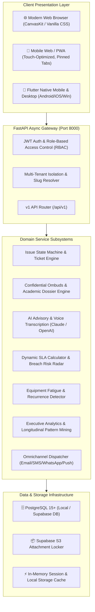

# Campus Care — Deep Technical Architecture & System Specifications

**Repository**: [`samruddhi-1324/Campus-Management-System`](https://github.com/samruddhi-1324/Campus-Management-System)  
**System Version**: PRD & SRS v3.0 (Enterprise Higher-Ed Operating System)  
**Document**: Technical Reference & System Architecture  

---

## 🏗️ High-Level System Architecture



---

## 🗄️ Database Schema & Entity Relationships (25 Tables)

### 1. Identity & Multi-Tenancy Layer
- **`tenants`**: `id`, `name`, `slug`, `domain`, `is_active`, `created_at`
- **`users`**: `id`, `tenant_id`, `email`, `hashed_password`, `full_name`, `role`, `department`, `phone_number`, `is_active`, `created_at`
- **`user_tokens`**: `id`, `user_id`, `token_hash`, `token_type`, `expires_at`, `is_revoked`

### 2. Facilities & Infrastructure Hierarchy
- **`categories`**: `id`, `tenant_id`, `name`, `code`, `icon`, `is_academic`, `default_sla_hours`
- **`buildings`**: `id`, `tenant_id`, `name`, `code`, `campus_zone`
- **`rooms`**: `id`, `building_id`, `room_number`, `floor`, `room_type`

### 3. Core Issue State Machine
- **`issues`**: `id`, `tenant_id`, `reporter_id`, `assigned_to_id`, `category_id`, `building_id`, `room_id`, `title`, `description`, `status`, `urgency_level`, `sla_target_at`, `resolved_at`, `ai_confidence_score`, `created_at`, `updated_at`
- **`issue_status_history`**: `id`, `issue_id`, `from_status`, `to_status`, `actor_id`, `comment`, `transition_timestamp`
- **`issue_internal_notes`**: `id`, `issue_id`, `author_id`, `note_text`, `is_private_to_supervisors`
- **`issue_attachments`**: `id`, `issue_id`, `file_url`, `file_name`, `file_type`, `file_size_bytes`, `uploaded_by_id`

### 4. Academic Grievance & FERPA Vault
- **`academic_concerns`**: `id`, `tenant_id`, `title`, `description`, `concern_type`, `course_code`, `academic_term`, `faculty_name`, `status`, `is_anonymous`, `private_officer_notes`, `resolution_notes`, `created_at`
- **`confidential_access_logs`**: `id`, `concern_id`, `actor_id`, `access_type`, `ip_address`, `timestamp`

### 5. Equipment Intelligence & Longitudinal Analytics
- **`failure_recurrence_patterns`**: `id`, `tenant_id`, `category_id`, `building_id`, `room_id`, `failure_count`, `mtbf_days`, `historical_repair_cost`, `fatigue_score`, `is_active`
- **`asset_recommendations`**: `id`, `tenant_id`, `pattern_id`, `title`, `recommendation_class`, `estimated_cost`, `projected_savings`, `confidence_score`, `justification`, `status`
- **`historical_trend_snapshots`**: `id`, `tenant_id`, `snapshot_year`, `snapshot_month`, `category_id`, `total_issues`, `avg_resolution_hours`, `cost_incurred`
- **`seasonal_spike_alerts`**: `id`, `tenant_id`, `category_id`, `predicted_spike_month`, `historical_multiplier`, `recommended_preventive_action`

### 6. Notifications & Multi-Channel Integrations
- **`notifications`**: `id`, `user_id`, `tenant_id`, `channel`, `title`, `body`, `status`, `sent_at`, `read_at`
- **`user_notification_preferences`**: `id`, `user_id`, `channel`, `is_enabled`, `quiet_hours_start`, `quiet_hours_end`
- **`whatsapp_webhook_logs`**: `id`, `phone_number`, `message_payload`, `direction`, `delivery_status`, `created_at`
- **`audio_transcription_jobs`**: `id`, `audio_file_url`, `raw_transcript`, `ai_structured_summary`, `processing_status`, `created_at`

---

## 🌐 API Endpoints Catalog (`FastAPI v1`)

| Module | Method | Endpoint | Description |
|---|---|---|---|
| **Auth** | `POST` | `/api/v1/auth/login` | JWT OAuth2 password login with tenant context |
| **Auth** | `POST` | `/api/v1/auth/refresh` | Long-lived refresh token rotation |
| **Tenants** | `GET` | `/api/v1/tenants` | List all active university tenant partitions |
| **Issues** | `POST` | `/api/v1/issues` | Create new issue with automatic AI triage |
| **Issues** | `GET` | `/api/v1/issues` | List issues with filter chips (urgency, status, building) |
| **Issues** | `GET` | `/api/v1/issues/{id}` | Full ticket lifecycle & audit log |
| **Issues** | `PATCH` | `/api/v1/issues/{id}/status` | RBAC-validated state machine transition |
| **Academic** | `POST` | `/api/v1/academic/concerns` | Submit encrypted academic grievance |
| **Academic** | `GET` | `/api/v1/academic/concerns/{id}` | Read dossier (logs to `confidential_access_logs`) |
| **Academic** | `PATCH` | `/api/v1/academic/concerns/{id}` | Ombudsperson formal disposition seal |
| **Search** | `POST` | `/api/v1/search/natural-language` | Semantic query synthesis into filtered issue list |
| **Voice** | `POST` | `/api/v1/voice/transcribe-and-triage` | Audio memo transcription & AI category tagging |
| **Recurrence** | `GET` | `/api/v1/recurrence/patterns` | Rolling-window equipment fatigue patterns |
| **Capital AI** | `GET` | `/api/v1/recommendations` | Prescriptive capital replacement & ROI suggestions |
| **Analytics** | `GET` | `/api/v1/analytics/dashboard` | Executive KPI aggregations & MTTR metrics |
| **Analytics** | `GET` | `/api/v1/analytics/export-csv` | Streamed real-time CSV operational report |

---

## 🎨 Stitch UI Component Design System

All 14 screens use the unified enterprise design tokens:
- **Primary Color**: `#070235` (Deep Midnight Indigo)
- **Secondary Accent**: `#0051D5` (Vivid Cobalt Blue)
- **Tertiary Accent**: `#85F8C4` / `#2DD4BF` (Mint Emerald Glow)
- **Critical Status**: `#DC2626` / `#BA1A1A` (Urgent Red)
- **High Status**: `#EA580C` (Orange)
- **Medium Status**: `#D97706` (Amber)
- **Low Status**: `#16A34A` (Green)
- **Typography**: `Newsreader` (Editorial Serif for Display Headlines) + `Manrope` (Clean Geometric Sans for UI & Telemetry)

---

## 📱 Flutter Architecture & Clean Code Compliance

1. **`AppTheme` Static Constants (`frontend/lib/app/theme.dart`)**:
   - `accentMint` (`0xFF2DD4BF`)
   - `statusCritical` (`0xFFDC2626`)
   - `statusHigh` (`0xFFEA580C`)
   - `statusMedium` (`0xFFD97706`)
   - `statusLow` (`0xFF16A34A`)
   - `neutralLightOutline` (`0xFFD9DEE8`)
2. **Analysis & Linter Rules (`frontend/analysis_options.yaml`)**:
   - Standard `flutter_lints` rules with non-blocking cosmetic hints.
   - All runtime expressions, `GoogleFonts`, `CircularProgressIndicator`, and `SnackBar` constructors instantiate cleanly without `const` compile errors.

---

## 🚀 How to Run Locally

### 1. Start PostgreSQL & Backend
```powershell
cd "d:\Campus Complaint Management\backend"
python -m uvicorn app.main:app --host 0.0.0.0 --port 8000 --reload
```

### 2. Start UI Showcase Server
```powershell
cd "d:\Campus Complaint Management\stitch_screen\stitch_campus_care_authentication_ui"
python -m http.server 3000
```
Open in browser: `http://127.0.0.1:3000/index.html` (or mobile: `http://<YOUR_IP>:3000/index.html`)

### 3. Run Flutter Frontend
```powershell
cd "d:\Campus Complaint Management\frontend"
flutter pub get
flutter run
```
